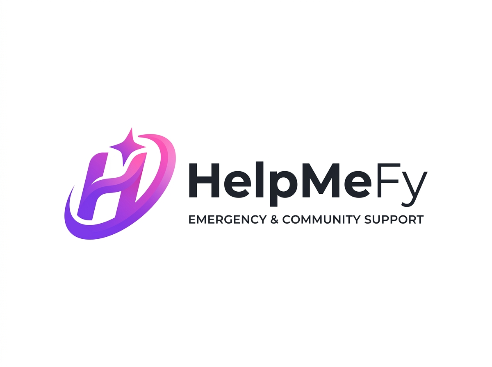

<div align="center">
  
  <h1>HelpMeFy</h1>
  <p><b>Simplifying Help, Amplifying Hope.</b></p>
  <p>A community-driven, decentralized platform built to connect individuals in need with immediate peer-to-peer assistance during crises.</p>
  
  <p>
    <a href="https://project-work-ca2.vercel.app/"><strong>View Live Demo »</strong></a>
  </p>

  <p>
    
    
    
  </p>
</div>

<br/>

## 🚀 About The Project

During crises or local emergencies, getting immediate peer-to-peer support is often highly disorganized and inefficient. **HelpMeFy** solves this by providing a unified, highly scalable platform where users can broadcast emergency SOS alerts, categorize their needs, and receive direct community support with real-time tracking.

This project is engineered to ensure high availability, modern accessibility, and an intuitive user experience across all devices.

### ✨ Key Features

- **🚨 Decentralized SOS Grid:** Broadcast emergency alerts with live GPS coordinates to all volunteers within a 5km radius.
- **🌗 Intelligent Dark Mode:** Full native dark/light theme support built right into the core UI with memory state.
- **🌍 Multi-Language Support:** Seamlessly integrated translation support catering to regional users (English and Hindi).
- **🛡️ Community Dashboard:** A categorized, live view of active help requests in the vicinity.
- **🔒 Secure Authentication:** Robust login, registration, and session management system.
- **📱 Responsive Architecture:** Built with modern Tailwind CSS and AOS animations for a flawless mobile-first experience.

<br/>

## 💻 Tech Stack

- **Frontend:** HTML5, Tailwind CSS, Vanilla JavaScript, FontAwesome
- **Animations:** AOS (Animate On Scroll), CSS Micro-interactions
- **Backend:** PHP (Session & Authentication Logic)
- **Database:** MySQL
- **Deployment:** Vercel (Frontend Hosting)

<br/>

## 🛠️ Installation & Setup

To run this project locally, you will need a local PHP server (such as XAMPP, WAMP, or MAMP).

1. **Clone the repository**
   ```bash
   git clone https://github.com/shubhamkumar-git01/Project-work-CA2.git helpmefy
   ```
2. **Move to Server Directory**
   Move the `helpmefy` folder into your local server's root directory:
   - For XAMPP: `C:/xampp/htdocs/`
   - For WAMP: `C:/wamp/www/`
3. **Database Configuration**
   - Create a new MySQL database for the project.
   - Import the `database.sql` file to set up the necessary tables.
   - Update the database credentials in `db.php` if required.
4. **Run the Application**
   Open your browser and navigate to:
   ```text
   http://localhost/helpmefy/index.html
   ```

<br/>

## 🤝 Contributing

Contributions are what make the open source community such an amazing place to learn, inspire, and create. Any contributions you make are **greatly appreciated**.

1. Fork the Project
2. Create your Feature Branch (`git checkout -b feature/AmazingFeature`)
3. Commit your Changes (`git commit -m 'Add some AmazingFeature'`)
4. Push to the Branch (`git push origin feature/AmazingFeature`)
5. Open a Pull Request

<br/>

## 👨‍💻 Architect & Lead Developer

**Shubham Kumar**  
*Full Stack Developer & Founder*  
- [GitHub Profile](https://github.com/shubhamkumar-git01)
- [LinkedIn Profile](https://linkedin.com/in/shubham-kumar-sk01)

<br/>

<div align="center">
  <p>Made with ❤️ in India.</p>
</div>
